# Blacklight

<p align="center">
    
</p>

A local-only tool that indexes `~/.claude/` — the hidden directory where Claude Code stores every conversation, tool call, file edit, and session artifact — and makes it visible, searchable, and understandable.

Single Rust binary.  
Single SQLite file.  
Embedded web dashboard.  
No cloud, no daemon, no external services.  

## Why

Claude Code stores tons of structured data in `~/.claude/` with no way to browse it. 

Blacklight gives you:

- **Full-text search** across every conversation, tool output, and thinking block
- **Session replay** with rendered content blocks, tool call cards, and collapsible thinking
- **AI enrichment** — auto-generated titles, summaries, and confidence-scored tags via Claude API or local Ollama
- **Analytics** — token usage by model, daily activity charts, tool frequency, session outcomes
- **Project view** — sessions grouped by project with activity metrics and tool usage breakdown
- **File provenance** — which files Claude has read, written, and edited across all sessions
- **Storage analysis** — content deduplication stats, blob store breakdown by kind
- **Real-time controls** — start/stop/pause indexing and enrichment from the web UI with live progress

### Screenshots

| Dashboard | Sessions | Analytics |
|-----------|----------|-----------|
| 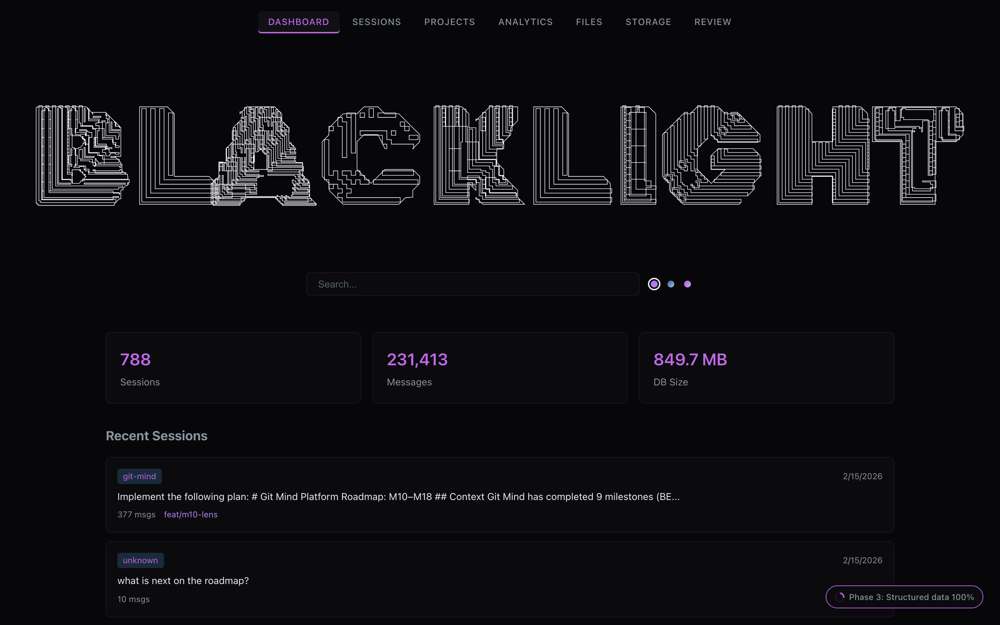 | 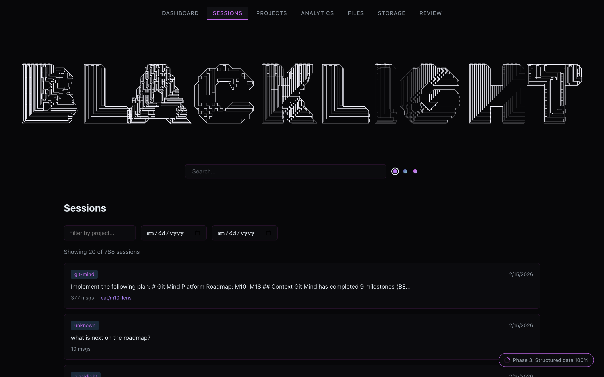 | 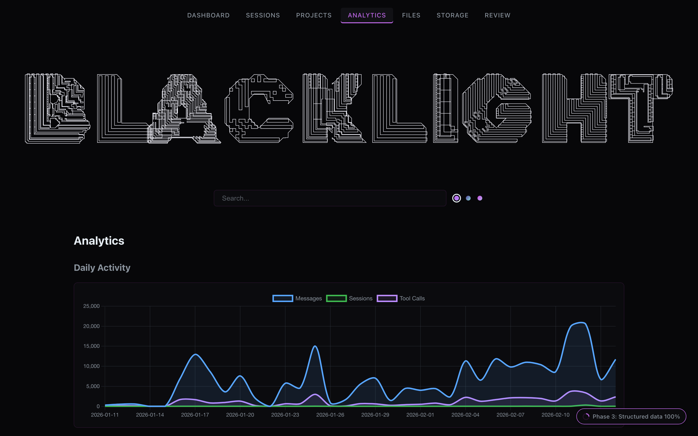 |

| Session Detail | Search | Projects |
|----------------|--------|----------|
| 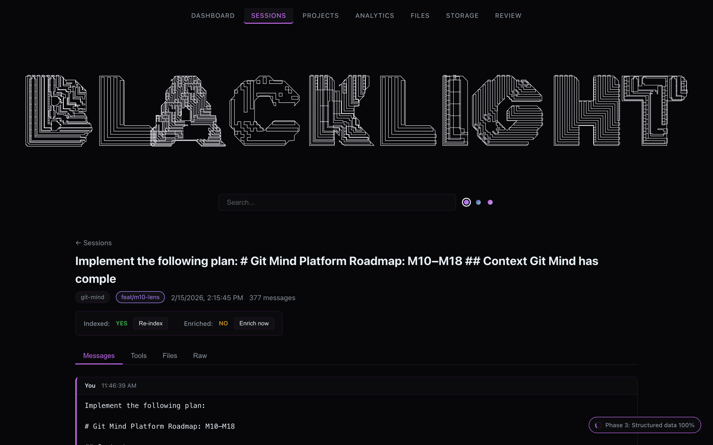 | 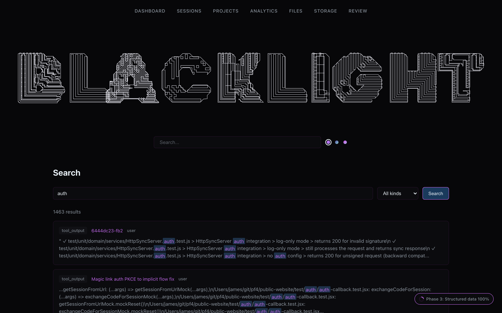 | 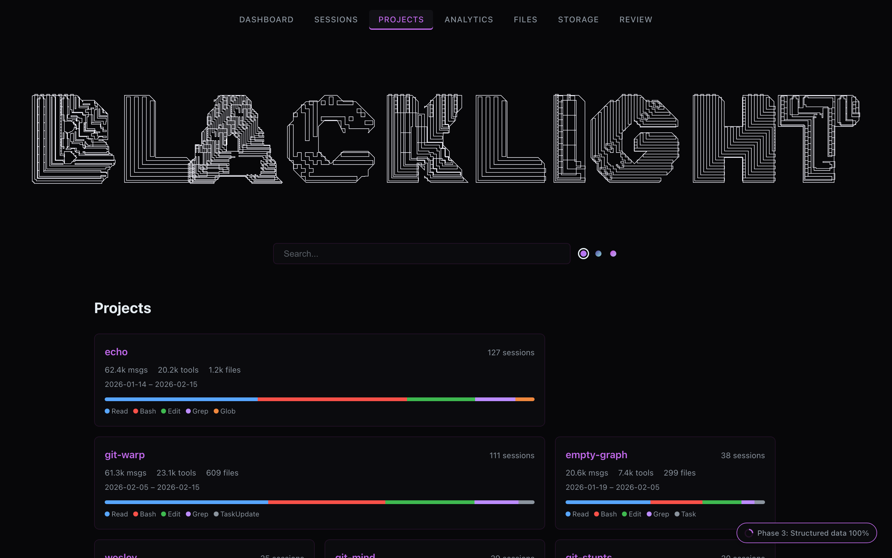 |

<details>
<summary>Theme gallery (Slate / Indigo / Orchid)</summary>

| Slate | Indigo | Orchid |
|-------|--------|--------|
|  | 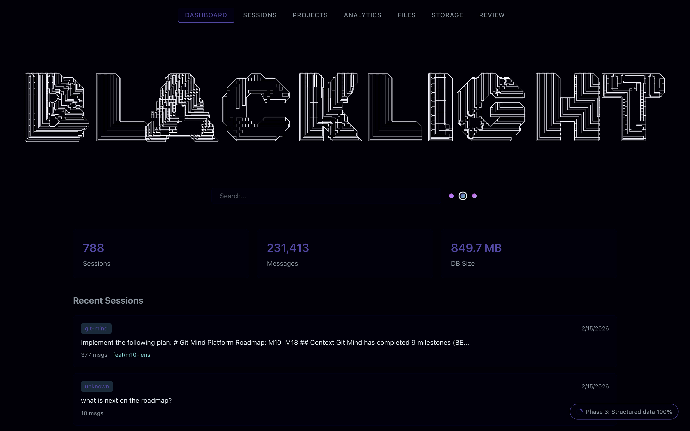 | 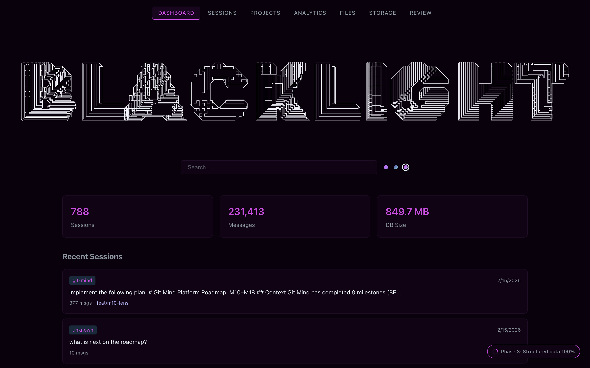 |
|  | 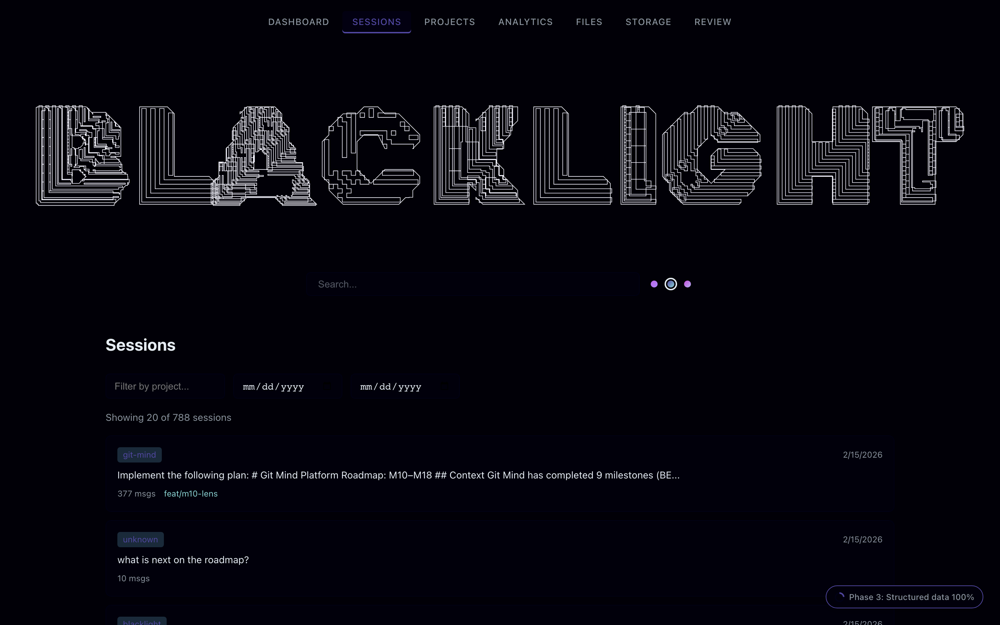 | 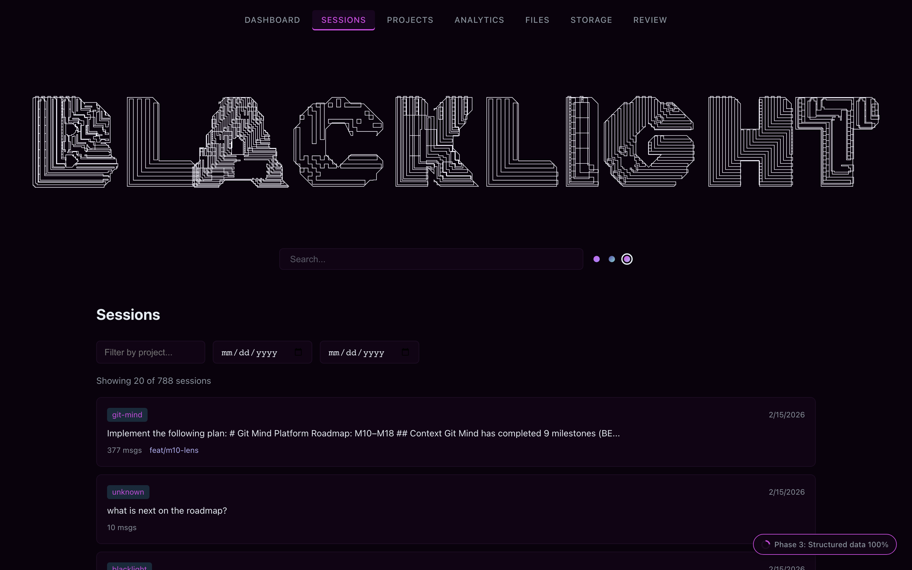 |
|  | 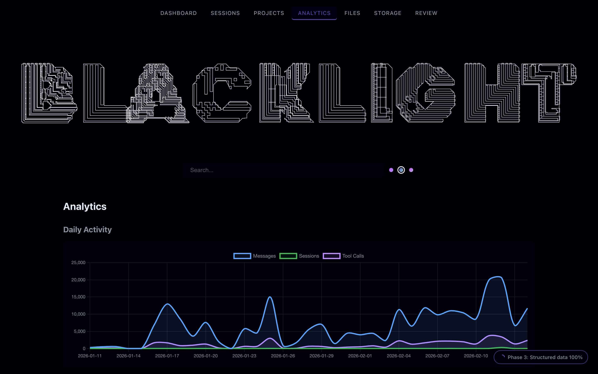 | 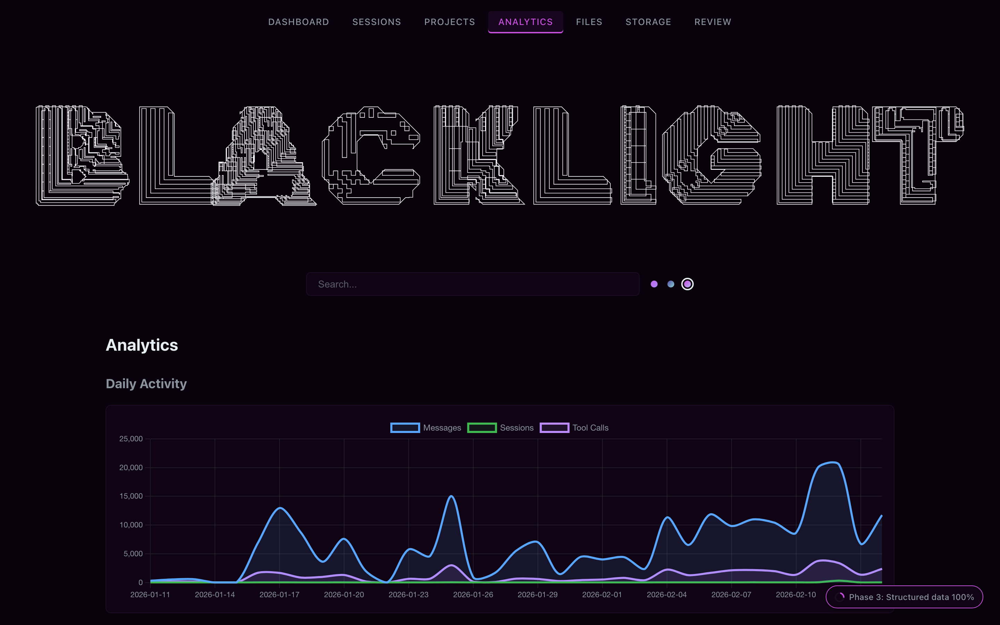 |

</details>

## Quick Start

```bash
# Build
cargo build --release

# Index your Claude Code data
./target/release/blacklight index

# Launch the dashboard (opens browser to localhost:3141)
./target/release/blacklight serve
```

That's it. 

The indexer scans `~/.claude/`, parses every JSONL session file, and populates a local SQLite database.  
The web server embeds the frontend — no separate process needed.

### Docker

```bash
docker compose up
```

This mounts `~/.claude` read-only into the container and exposes the dashboard on port 3141. Set `ANTHROPIC_API_KEY` in your environment if you want AI enrichment.

## CLI

```
blacklight init                     # write default config to ~/.blacklight/blacklight.toml
blacklight index                    # incremental index (only new/modified files)
blacklight index --full             # full re-index from scratch
blacklight serve                    # web UI on :3141
blacklight serve --port 8080        # custom port
blacklight serve --no-open          # don't auto-open browser
blacklight enrich                   # AI-enrich unenriched sessions
blacklight enrich --limit 50        # enrich up to 50 sessions
blacklight enrich --concurrency 3   # 3 concurrent API calls
blacklight enrich --force           # re-enrich already enriched sessions
# NOTE: CLI search/stats are currently dashboard-only (/search and /analytics pages)
```

Global options: `--db <path>`, `--claude-dir <path>`, `--config <path>` (defaults to `~/.blacklight/blacklight.toml`).

## Multi-LLM Configuration

Blacklight 0.2.0 supports indexing from multiple sources simultaneously. Configure them in `~/.blacklight/blacklight.toml`:

```toml
# ~/.blacklight/blacklight.toml

backup_dir = "~/.blacklight/backups/"
backup_mode = "gitcas" # gitcas | simple

[[sources]]
name = "claude-work"
path = "~/.claude/"
kind = "claude"
cas_prefix = "work"

[[sources]]
name = "personal-gemini"
path = "~/.gemini/"
kind = "gemini"
cas_prefix = "me"

[[sources]]
name = "codex-exp"
path = "~/.codex/"
kind = "codex"
```

**Supported kinds:** `claude`, `gemini`, `codex`.

## Upgrading from V3 to V4

If you are upgrading from an older version of Blacklight, you need to migrate your data to the new bit-perfect provenance standard:

1. **Launch the dashboard:** Run `./blacklight serve`.
2. **Open the HUD:** Click the pill in the bottom-right corner.
3. **Go to Migration:** Select the "Migration" tab.
4. **Start Migration:** Click "Start Migration".

This process will:
- **Backup:** Copy all your existing session files into the CAS.
- **Fingerprint:** Calculate cryptographic signatures for every turn and session.
- **Verify:** Ensure your history is bit-perfect and immutable.

## Architecture

Blacklight treats LLM logs as an immutable "Causal Memory." See [ARCHITECTURE.md](./ARCHITECTURE.md) for a deep dive into ingest, provenance, and the CAS layer.

## Tech Stack

Nine pages accessible from the nav:

| Page | What it shows |
|------|---------------|
| **Dashboard** | Session count, message count, DB size, recent sessions |
| **Sessions** | Filterable/paginated session list with project and date range filters |
| **Session Detail** | Message thread, tool calls, file operations, raw JSONL inspector (4 tabs) |
| **Projects** | Project grid with per-project stats, tool usage bars, date ranges |
| **Search** | FTS5 search with kind filter (text, tool output, thinking) and highlighted snippets |
| **Analytics** | Daily activity chart, model token usage, top tools, outcome distribution |
| **Files** | Every file path Claude has touched, with operation type and session links |
| **Storage** | Blob store stats, dedup ratio, content breakdown by kind |
| **Review** | Approval queue for AI-generated enrichments — approve, reject, or bulk approve |

The **IndexerHUD** (bottom-right widget) lets you control indexing and enrichment without leaving the page — start, pause, resume, stop, view logs, and configure the background scheduler. Shows live "X/Y files indexed" and "X/Y sessions enriched" counts with "Last updated" timestamps.

Real-time **WebSocket notifications** push status updates to the browser as indexing and enrichment progress.

**Four color themes** — Slate (purple/violet), Indigo (deep blue/teal), Orchid (pink/magenta), and Quartz (light mode). Switch via the dots next to the search bar. Choice persists in localStorage.

## AI Enrichment

Blacklight can auto-generate a title, summary, and tags for each session by sending a digest (first 20 messages, tools used, project context) to an LLM.

**Supported backends** (set `preferred_backend` in config, or leave as `"auto"` for fallback order):
1. **Local Ollama** — auto-detected at `localhost:11434`, or set `ollama_url` / `OLLAMA_MODEL`
2. **Google Gemini** — set `google_api_key` in config or `GOOGLE_API_KEY` env var
3. **Claude CLI** — uses the `claude` command on your PATH (no API key needed)

In `"auto"` mode, Blacklight tries Ollama first, then Gemini, then Claude CLI.

Enrichments go through an **approval workflow**: tags below the `auto_approve_threshold` (default 0.80) land in `pending_review` status and appear on the Review page. Approve or reject individually, or bulk-approve all. Only approved enrichments show as session titles in the UI.

The background **scheduler** can automate both indexing and enrichment on a configurable interval, managed from the HUD's Schedule tab or via the `[scheduler]` config section.

## Architecture

```bash
src/
├── main.rs              CLI entry (clap)
├── config.rs            TOML config loading, defaults, tilde expansion
├── config_template.toml Template for `blacklight init`
├── db.rs                SQLite migrations, configurable PRAGMAs
├── schema.sql           Tables, indexes, FTS5
├── models.rs            Serde types for ~/.claude/ data
├── content.rs           BLAKE3 hashing, blob store, FTS5 ops
├── enrich.rs            AI enrichment (Ollama / Gemini / Claude CLI)
├── notifications.rs     WebSocket broadcast channel
├── indexer/
│   ├── mod.rs           Orchestrator: scan → detect → parse → store
│   ├── scanner.rs       File discovery + classification
│   ├── change.rs        Incremental change detection (mtime/size/offset)
│   ├── jsonl.rs         Streaming JSONL reader with byte-offset resume
│   ├── router.rs        Message type dispatch + batch accumulator
│   ├── handlers.rs      Content block → blob + FTS + tool_call extraction
│   ├── file_paths.rs    File path extraction from tool_use/tool_result
│   ├── db_ops.rs        Batch INSERT with single-transaction flush
│   └── structured.rs    Tasks, facets, stats, plans parsers
└── server/
    ├── mod.rs            Server startup
    ├── router.rs         Axum router (~30 endpoints + WebSocket)
    ├── state.rs          AppState, DbPool, indexer/enricher state
    ├── scheduler.rs      Background index + enrich loop
    ├── embedded.rs       rust-embed static frontend
    ├── responses.rs      API response types
    ├── errors.rs         Error handling
    ├── params.rs         Query parameter types
    ├── api/              Route handlers
    └── queries/          SQL query functions

frontend/                Vue 3 + TypeScript + Vite SPA
```

### Key design decisions

- **BLAKE3 content-addressable blob store** — identical content stored once, referenced many times. Dedup threshold at 256 bytes.
- **FTS5 with porter stemming** — "running" matches "run". BM25 ranking. `<mark>` highlighted snippets.
- **Byte-offset resume** — JSONL files tracked by mtime, size, and last byte offset. Incremental re-indexing resumes mid-file.
- **Batch transactions** — 500-message batches flushed in a single SQLite transaction with INSERT OR IGNORE for dedup.
- **WAL mode SQLite** — 64MB cache, 256MB mmap. Web server reads while indexer writes.
- **Progress message skip** — `normalizedMessages` fields (96% of progress line content) are dropped, cutting parseable data from ~4.5GB to ~1GB.

## Tech Stack

| Layer | Choice |
|-------|--------|
| Language | Rust |
| Database | SQLite (bundled via rusqlite, FTS5 included) |
| Content hashing | BLAKE3 |
| Web server | axum + tower-http (CORS, gzip) |
| Frontend | Vue 3, TypeScript, Vite, Chart.js, GSAP |
| CLI | clap |
| AI enrichment | reqwest → Claude API / Ollama |

## Development

```bash
cargo build          # build backend
cargo test           # run tests
cargo clippy         # lint

cd frontend
npm install          # install frontend deps
npm run dev          # dev server with hot reload (proxies API to :3141)
npm run build        # production build (output embedded by rust-embed)
```

Run the backend and frontend dev server simultaneously during development — Vite proxies `/api` and WebSocket connections to `localhost:3141`.

## License

Apache-2.0

Copyright © 2026 James Ross

---

<p align="center">
<sub>Built by <a href="https://github.com/flyingrobots">FLYING ROBOTS</a></sub>
</p>
