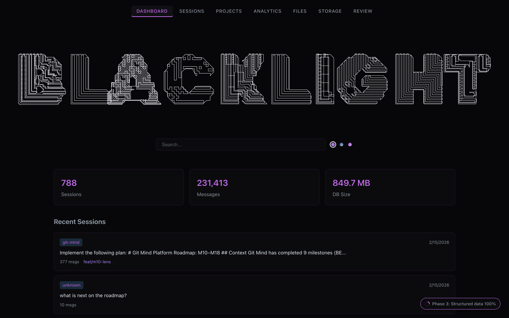
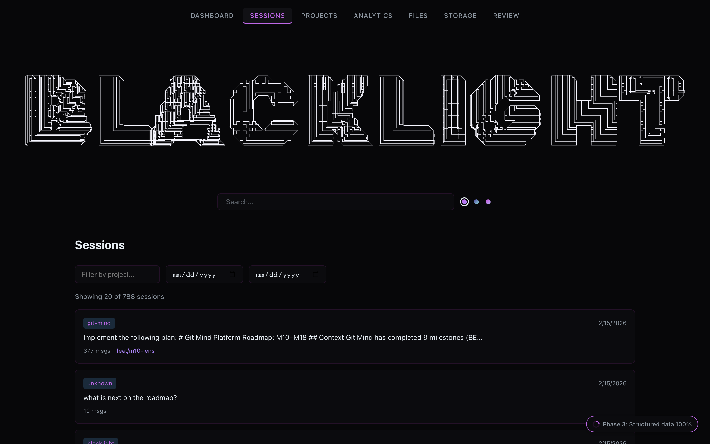
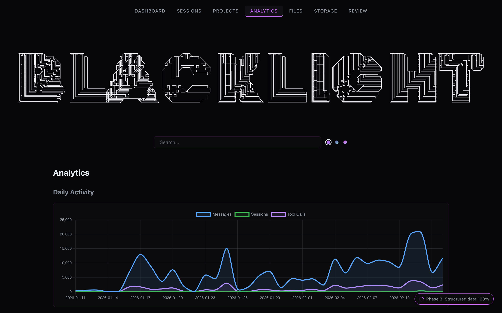

# Blacklight

<p align="center">
  
</p>

Blacklight is a local-first observability and memory layer for AI coding sessions.
It ingests session artifacts from Claude, Gemini, and Codex directories, indexes them into SQLite, and serves an embedded web UI for search, replay, analytics, provenance, and enrichment.

Core runtime is one Rust binary plus one SQLite database.

## What Blacklight Does

- Indexes multi-source session history (`claude`, `gemini`, `codex`) into a single local database.
- Preserves source files in a backup CAS (Git CAS mode or simple hash-addressed mode).
- Stores cryptographic fingerprints for messages, tool calls, and sessions.
- Deduplicates large content blobs and exposes full-text search with SQLite FTS5.
- Serves a web dashboard with session drilldown, project analytics, file provenance, and storage stats.
- Runs optional AI enrichment (title/summary/tags) and outcome classification with local LLMs.
- Supports background scheduling for periodic indexing, enrichment, and classification.

## Blacklight Companion (macOS)

Blacklight includes a menu bar companion app for macOS that provides a quick HUD for monitoring and controlling background jobs.

### Features
- **Real-time Status:** View the status of the Indexer, Enricher, and Classifier.
- **Background Controls:** Start, Pause, and Stop jobs directly from the menu bar.
- **Deep Linking:** Quick shortcut to open the full web dashboard.

### Running the Companion
```bash
cd companion
npm install
npm run start
```

## Screenshots

| Dashboard | Sessions | Analytics |
|-----------|----------|-----------|
|  |  |  |

## How It Works

1. Source discovery: reads configured `[[sources]]` and auto-discovers common local paths (`~/.gemini`, `~/.codex`, Claude Desktop session directories on macOS).
2. File scan and classification: classifies known artifacts (session JSONL/JSON, indexes, tasks, facets, stats, plans, history).
3. Incremental change detection: compares files against `indexed_files` (mtime, size, byte offset) and skips unchanged data unless `--full`.
4. Parsing and normalization: routes each source format into unified relational tables (`sessions`, `messages`, `content_blocks`, `tool_calls`, `file_references`).
5. Backup and provenance: writes source backups to Git CAS, records OIDs, and updates fingerprints.
6. Search and analytics: indexes text in FTS5 and exposes query endpoints for UI pages.
7. Runtime control: exposes `/api` endpoints plus WebSocket notifications for HUD progress and alerts.

## Supported Sources

| Kind | Typical Path | Parsed Artifacts |
|------|--------------|------------------|
| `claude` | `~/.claude/` | `projects/**/sessions-index.json`, `projects/**/*.jsonl`, tasks, facets, plans, history, stats |
| `gemini` | `~/.gemini/` | Gemini session JSON (`session-*.json` in chats paths) |
| `codex` | `~/.codex/` | Codex rollout JSONL (`sessions/**/rollout-*.jsonl`), plans, tasks, tool calls |

## Quick Start (Local)

### Prerequisites

- Rust toolchain
- Node.js (for frontend build)
- Git + [`git-cas`](https://github.com/git-stunts/git-cas)
- Optional for enrichment:
  - Ollama running locally
  - or `GOOGLE_API_KEY`
  - or `claude` CLI on `PATH`

### Build and Run

```bash
# from repo root
npm install
npm run build

# optional: write a default config file
./target/debug/blacklight init

# index your local session data
./target/debug/blacklight index

# serve dashboard at http://127.0.0.1:3141
./target/debug/blacklight serve
```

## CLI Reference

```bash
blacklight init
blacklight index [--full] [--source <path>] [--verbose]
blacklight serve [--port <n>] [--no-open]
blacklight enrich [--limit <n>] [--concurrency <n>] [--force]
blacklight classify [--limit <n>] [--force]
blacklight search <query> [--project <slug>] [--kind <text|tool_output|thinking|plan>]
blacklight stats [--daily] [--models] [--projects]
blacklight open <session-id>
```

## API Surface (High Level)

Base path: `/api`

- Sessions: `/sessions`, `/sessions/{id}`, `/sessions/{id}/messages`, `/sessions/{id}/tools`, `/sessions/{id}/files`, `/sessions/{id}/raw`, `/sessions/{id}/outcome`
- Search: `/search`
- Analytics: `/analytics/overview`, `/analytics/coverage`, `/analytics/daily`, `/analytics/daily-projects`, `/analytics/models`, `/analytics/tools`, `/analytics/projects`, `/analytics/llms`, `/analytics/outcomes`
- Files and storage: `/files`, `/storage`, `/content/{hash}`
- Background control: `/indexer/*`, `/enrichment/*`, `/classifier/*`, `/schedule`, `/migration/*`
- Review workflow: `/review`, `/review/{session_id}/approve`, `/review/{session_id}/reject`, `/review/approve-all`
- Notifications: `/ws`

## Project Structure

- `src/`: Rust backend (CLI, Indexer, API Server)
- `frontend/`: Vue.js web dashboard
- `companion/`: Electron menu bar companion (macOS)
- `tests/`: Integration tests

## License

Apache-2.0
